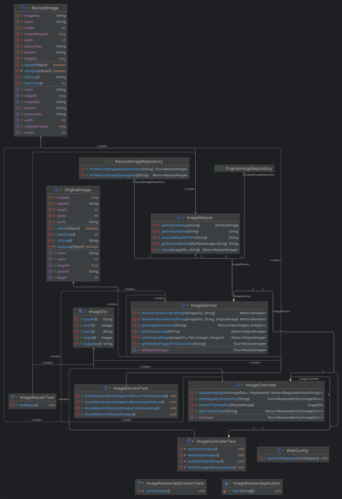

# ORZESZKI - Changelog

## [6.12.2024] Plan działania
### Technologie
- backend: Spring + Webflux 
- frontend: React + RxJs
- baza danych: Postgres
  
### Schemat bazy danych

### Diagram klas backend

### Frontend
Na frontendzie przewidujemy oprócz klasy `App.jsx` tylko plik `ImageGrid.jsx` zawierający obsługę strony głównej do uploadowania i wyświetlania obrazków oraz plik z pomocniczymi funkcjami do obsługi plików zip i generowania kluczy dla obrazków.

### Koncepcja rozwiązania
- Użytkownik uploaduje obrazek na frontendzie
- Frontend mapuje obrazki przydzielając im unikalne klucze i układając je w grid - na razie wyświetlamy placeholder (obrazek się "ładuje")
- wysyłamy request POST, gdzie w body umieszczamy obrazek zakodowany kodowaniem base64 i jego id i nazwę - w responsie otrzymujemy reaktywnie poszczególne obrazki już zresizowane i umieszczamy je w miejscu placeholdera o odpowiednim id
- backend po requeście resizuje obrazek i zapisuje jego kodowania base64 w bazie danych
- po kliknięciu w obrazek wysyłany jest request GET z id obrazka w RequestParam, a zwracany jest zakodowany w base64 oryginalny obrazek

### TODO
- [x] naprawić upload obrazków 
- [x] Placeholdery na każdy obrazek
- [x] Refactor backendu
- [x] Implementacja klasy ImageResizera
- [x] Implementacja powiększania obrazka
- [xd] Ładny frontend

## [13.12.2024] Milestone 1
### Schemat bazy danych
Uznaliśmy, że lepiej rozdzielić obrazki oryginalne i zresizowane - będzie to umożliwiało w przyszłości przechowywanie 
wielu miniaturek dla danego obrazu. Dodaliśmy też wymiary obrazu do każdej z tabel. Obecnie schemat bazy wygląda następująco:   

### Diagram klas backend
Diagram klas wygląda aktualnie następująco (wygenerowany przy pomocy IntelliJ):   

### Frontend
Koncepcja frontendu nie uległa znaczącym zmianom, wyodrębniliśmy jedynie plik `ImageUtils.jsx`, by oddzielić logicznie 
niektóre funkcje związane z przetwarzaniem obrazów i zwiększyć przejrzystość kodu.

### Flow
Dostępne są dwa przyciski:
   - load - ładuje wszystkie obrazki dostępne w bazie danych
   - Choose file - pozwala wybrać plik *.zip z obrazkami     
Dla Choose file flow jest następujący:
   - uploadujemy plik *.zip
   - obrazki otrzymują unikalne klucze oraz jest tworzony na 
ich podstawie grid, w którym na razie umieszczamy placeholdery
   - wykonywany jest zwykły niereaktywny request POST, w którym wysyłamy obrazki do backendu (zakodowane w base64)
     - backend przyjmuje obrazki, przetwarza je (zmienia ich rozmiar oraz zapisuje w bazie oryginał i miniaturę), a następnie 
      zwraca klucz sesji w responseBody (klucz ten jest dodatkowo dodawany do każdej miniatury, by zapamiętać, które obrazki 
    były uploadowane w danej sesji i zwrócić tylko te właśnie obrazki w responseBody, a nie wszystkie, które istnieją w bazie danych)
   - Dzięki kluczowi sesji frontend zaczyna nasłuchiwać przez EventSource na server-sent event, jakim jest request `GET /resized`. 
W RequestParam podajemy otrzymany wcześniej klucz sesji
   - Backend dostaje request `GET /resized` i na podstawie klucza z RequestParam `sessionKey` wyciąga z bazy danych wszystkie 
miniatury obrazków dla podanego `sessionKey`, a następnie zwraca je w reaktywnym strumieniu (każdy obrazek jest osobnym ResponseEntity).
Na końcu strumienia dodajemy "sztucznie" obrazek o wszystkich atrybutach "COMPLETE_REQUEST", by zasygnalizować frontendowi, 
że ma zdezaktywować nasłuchiwanie na EventSource
   - frontend otrzymuje w strumieniu reaktywnym obrazki i od razu ustawia każdy z nich w odpowiednim miejscu grida
   - Po otrzymaniu obrazka końcowego "COMPLETE_REQUEST" wyłącza EventSource  

Dla `load` flow jest podobny:
- Wciskamy przycisk `load`
- Frontend zaczyna nasłuchiwać przez EventSource na server-sent event, jakim jest request `GET /resized/all`.
- Backend pobiera reaktywnie wszystkie obrazki z bazy i zwraca je w strumieniu `Flux`
- Na koniec dodawany jest obrazek "COMPLETE_REQUEST", który, j.w., informuje frontend, że należy zakończyć nasłuchiwanie 
na EventSource
- frontend otrzymuje w strumieniu reaktywnym obrazki i wstawia po kolei każdy z nich na pierwsze wolne miejsce w gridzie
- Po otrzymaniu obrazka końcowego "COMPLETE_REQUEST" wyłącza EventSource

Powiększanie obrazka zachodzi w następujący sposób:
 - Użytkownik klika na wybraną miniature
 - Frontend wysyła do Backendu zapytanie `GET /original` o oryginalny obraz na podstawie klucza ImageDto `imageKey`
 - Backend znajduje OriginalImage w bazie i odsyła `Mono` do Frontendu
 - Żadne dodatkowe mechanizmy nie są potrzebne gdyż to zawsze tylko jeden obrazek
 - Powiększony obrazek zostaje wyświetony na ekranie
 - Można go zamknać przyciskiem X

### Dodatkowe informacje
- Obrazki załadowane w danej sesji trzymane są w localStorage, by użytkownik po odświeżeniu strony nadal widział obrazki, 
które zuploadował/załadował z bazy.
- Przy kolejnych wciśnięciach przycisków kolejne zdjęcia wyświetlają się po tych wyświetlonych już wcześniej 
(nie usuwamy wcześniej załadowanych zdjęć, lecz poszerzamy powstałą "galerię")

### Fixy po review

- [x] ImageDto na record
- [x] ResizedImage i OriginalImage na prymitywy
- [x] Usunąć Lomboka
- [x] Uporządkować ImageService i przenieść ImageDto
- [x] Usunąć packmana w ImageService
- [x] Dodać placeholdery ???
- [?] Naprawić asynchroniczność

## [20.12.2024] Milestone 1 - review fix
### Schemat bazy danych
Schemat bazy danych nie uległ zmianie.
### Diagram klas backend
Nie dodawaliśmy ani nie usuwaliśmy żadnych klas, jedynie zastosowaliśmy się do 
sugestii z code review: typy kopertowe zamieniliśmy na prymitywne, ImageDto zamieniliśmy 
na rekord (w przypadku OriginalImage oraz ResizedImage nie było to możliwe, 
ponieważ  rekordy nie mogą być @Entity). Ponadto przenieśliśmy tworzenie ImageDto bezpośrednio do ImageControllera 
i zrobiliśmy drobny refactor kodu, izolując odpowiednie metody. W wyniku tych zmian należało też poprawić testy.

Obecnie diagram klas wygląda następująco:    
    

### Frontend
Zmiany dotyczyły głównie EventSource i reaktywnego odbierania response - opisane w sekcji `Flow`

### Flow
Dużym wyzwaniem było doprowadzenie endpointów do działania w pełni rekatywnie - głównie spowodowane brakiem odpowiednich
narzędzi po stronie frontendu, co zmusiło nas do poszukiwania alternatywnych rozwiązań w backendzie.
Jednym z pomysłów było wykorzystanie mechanizmu Sink z biblioteki Reactor, jednak powodowało to znaczne
opóźnienia w przetwarzaniu obrazków (branch `milestone1_fix_async`). Innym pomysłem było zwracanie w requeście POST /upload od razu zmniejszonych obrazków,
jednak tu pojawił się problem z odbiorem response reaktywnie na frontendzie - zastosowaliśmy rozwiązanie z wykorzystaniem
fetch oraz reader, było ono jednak niezbyt eleganckie, gdyż wymagało parsowania stringów i było reaktywne jedynie jeśli
obrazki "spływały" pojedynczo z backendu - w przeciwnym razie reader czytał tekst zawierający response
dla kilku obrazków na raz i dalsze parsowanie i przetwarzanie odbywało się już sekwencyjnie (branch `milestone1_fix_front`).
Obecne rozwiązanie opiera się na oryginalnym: zwracamy z POST /upload jedynie sessionKey, z tym że robimy to od razu,
nie czekając aż obrazki zostaną przetworzone i zapisane do bazy.
Od razu też frontend wysyła GET /resized z otrzymanym sessionKey. Korzystamy tutaj tak jak poprzednio z EventSource,
jednak zamykamy go dopiero kiedy upewnimy się, że otrzymaliśmy wszystkie obrazki - zostanie więc wysłanych wiele requestów
zanim zakończymy nasłuchiwanie. Takie działanie jest konieczne, ponieważ w pierwszym response 
możemy nie dostać wszystkich obrazków (gdyż jeszcze się liczą/są zapisywane do bazy). 

### Dodatkowe informacje
Zlikwidowaliśmy przechowywanie obrazków w localStorage, gdyż okazało się, 
że dla dużych zbiorów obrazków powodowało to problemy pamięciowe, przez co placeholdery się nie pokazywały.

## [03.01.2025] Milestone 2

### TODO:
- [x] Zmiany rozmiarów miniatur
- [x] Możliwość przełączania
- [] Odporność na awarie
